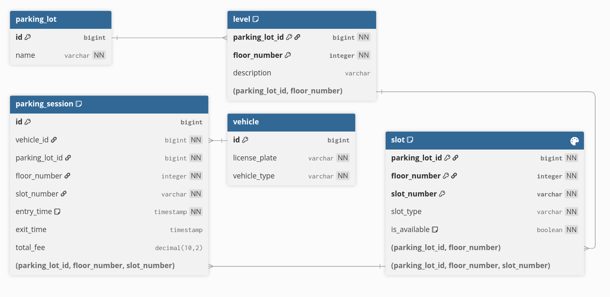

# Smart Parking System

## Overview of your solution and assumptions.
The Smart Parking System manages parking lots, levels, and slots,  
handling vehicle check-ins and check-outs.  
It supports multiple vehicle types (Motorcycle, Car, Truck)  
and slot types (Compact, Large, Handicapped),  
and calculates parking fees based on vehicle type and duration using a flexible strategy pattern.

## Database Schema



## Tech Stack
- **Language**: Java 17+
- **Framework**: Spring Boot 3.5.6
- **Build Tool**: Gradle
- **Database**: H2 (In-memory)
- **Testing**: JUnit 5, Mockito, MockMvc
- **REST API**: Spring Web

## Getting Started

### Prerequisites

- JDK 17+
- Gradle 7.0+

### Build & Run

```bash
# Build the project
gradle clean build

# Run tests
gradle test

# Start the application
gradle bootRun

# Or use ./gradlew instead of gradle
```

The server starts on `http://localhost:8080`

### API Documentation

Import the Postman collection for comprehensive API examples:

** [Smart Parking Postman Collection](doc/postman_collection.json)**

Or manually import the JSON collection file included in the repo.

#### Quick API Examples

**Create Parking Lot**
```bash
curl -X POST http://localhost:8080/api/v1/lots \
  -H "Content-Type: application/json" \
  -d '{"name":"Best Parking in Ukraine"}'
```

**Add Level**
```bash
curl -X POST http://localhost:8080/api/v1/lots/1/levels \
  -H "Content-Type: application/json" \
  -d '{"floorNumber":1}'
```

**Add Parking Slot**
```bash
curl -X POST http://localhost:8080/api/v1/lots/1/levels/1/slots \
  -H "Content-Type: application/json" \
  -d '{"slotNumber":1,"type":"COMPACT"}'
```

**Vehicle Check-in**
```bash
curl -X POST http://localhost:8080/api/v1/parking/sessions \
  -H "Content-Type: application/json" \
  -d '{"licensePlate":"License123","vehicleType":"CAR"}'
```

**Vehicle Check-out**
```bash
curl -X POST http://localhost:8080/api/v1/parking/sessions/License123/checkout
```

**View Active Sessions**
```bash
curl -X GET http://localhost:8080/api/v1/parking/sessions
```


## Fee Calculation Strategy

Pricing is extensible via the Strategy pattern. Current implementations:

| Vehicle Type | Base Rate  |
|-------------|------------|
| Motorcycle  | $1.00/hr   |
| Car         | $2.00/hr   |
| Truck       | $3.00/hr   |

Add custom pricing strategies by implementing `PricingStrategy` interface:

```java
public class OwnPricingStrategy implements PricingStrategy {
    @Override
    public BigDecimal calculateFee(VehicleType type, Duration duration) {
        // Custom logic
    }
}
```

## Implementation Coverage

### RESTful API

- Versioned endpoints: `/api/v1/...`
- Type-safe DTOs separate API contracts from domain models

## Testing

```bash
# Run all tests with coverage
gradle test --info

# Run specific test class
gradle test --tests ServiceLayerTest
```

Current test coverage includes:
- Unit tests for pricing strategies
- Service layer integration tests
- Controller endpoint tests with MockMvc

## Extension Points

### Adding a New Vehicle Type

1. Add to `VehicleType` enum
2. Implement corresponding `PricingStrategy`
3. Register strategy in `ParkingConfiguration.vehicleSlotCompatibility()`

### Adding a New Slot Type

1. Add to `SlotType` enum
2. Update slot compatibility rules in `Vehicle` or dedicated validator
3. Controller automatically supports the new type

## API Versioning

Current version: `v1` (`/api/v1/...`)
